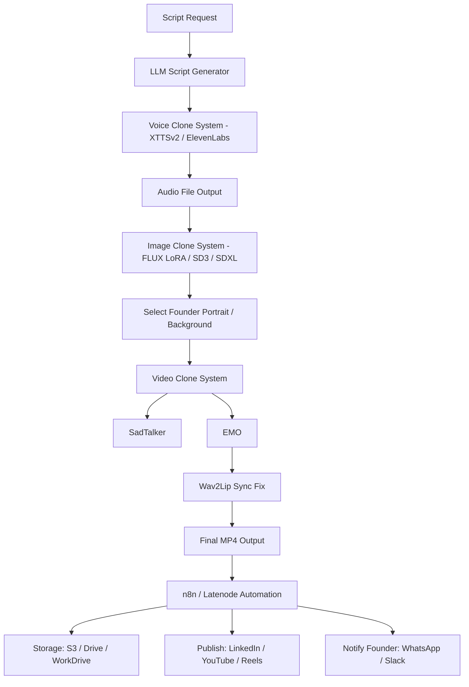

```mermaid
flowchart TD
    A[Script Request] --> B[LLM Script Generator]
    B --> C[Voice Clone System - XTTSv2 / ElevenLabs]
    C --> D[Audio File Output]

    D --> E[Image Clone System - FLUX LoRA / SD3 / SDXL]
    E --> F[Select Founder Portrait / Background]

    F --> G[Video Clone System]
    G --> G1[SadTalker]
    G --> G2[EMO]
    G2 --> G3[Wav2Lip Sync Fix]

    G3 --> H[Final MP4 Output]

    H --> I[n8n / Latenode Automation]
    I --> J[Storage: S3 / Drive / WorkDrive]
    I --> K[Publish: LinkedIn / YouTube / Reels]
    I --> L[Notify Founder: WhatsApp / Slack]
```
